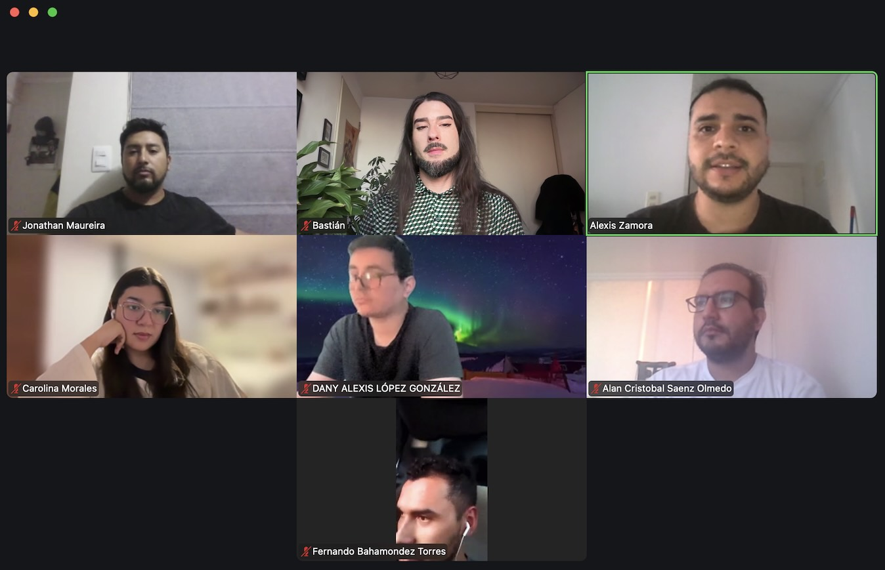
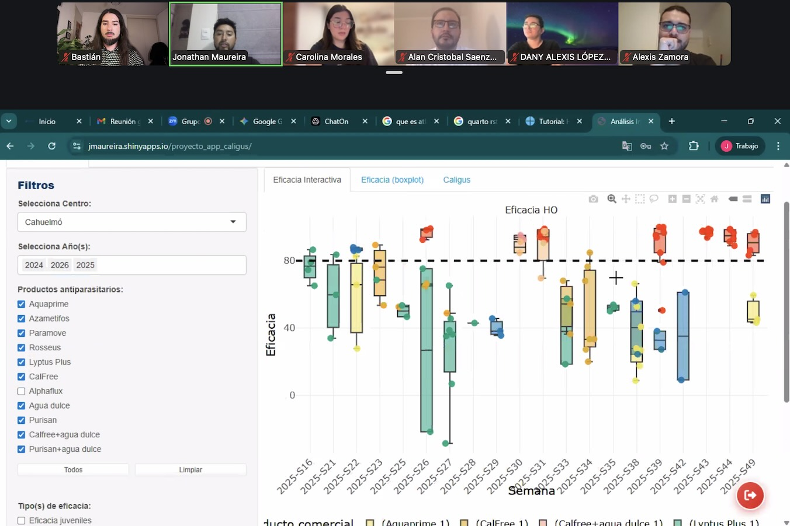
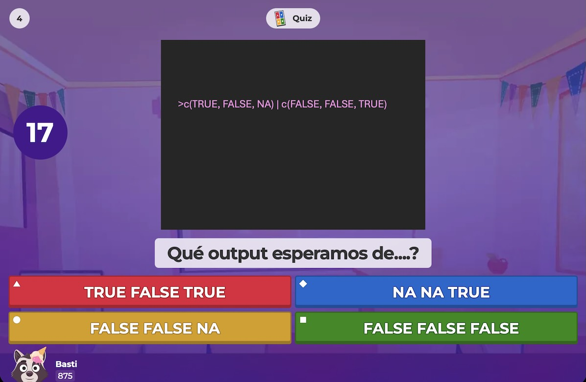
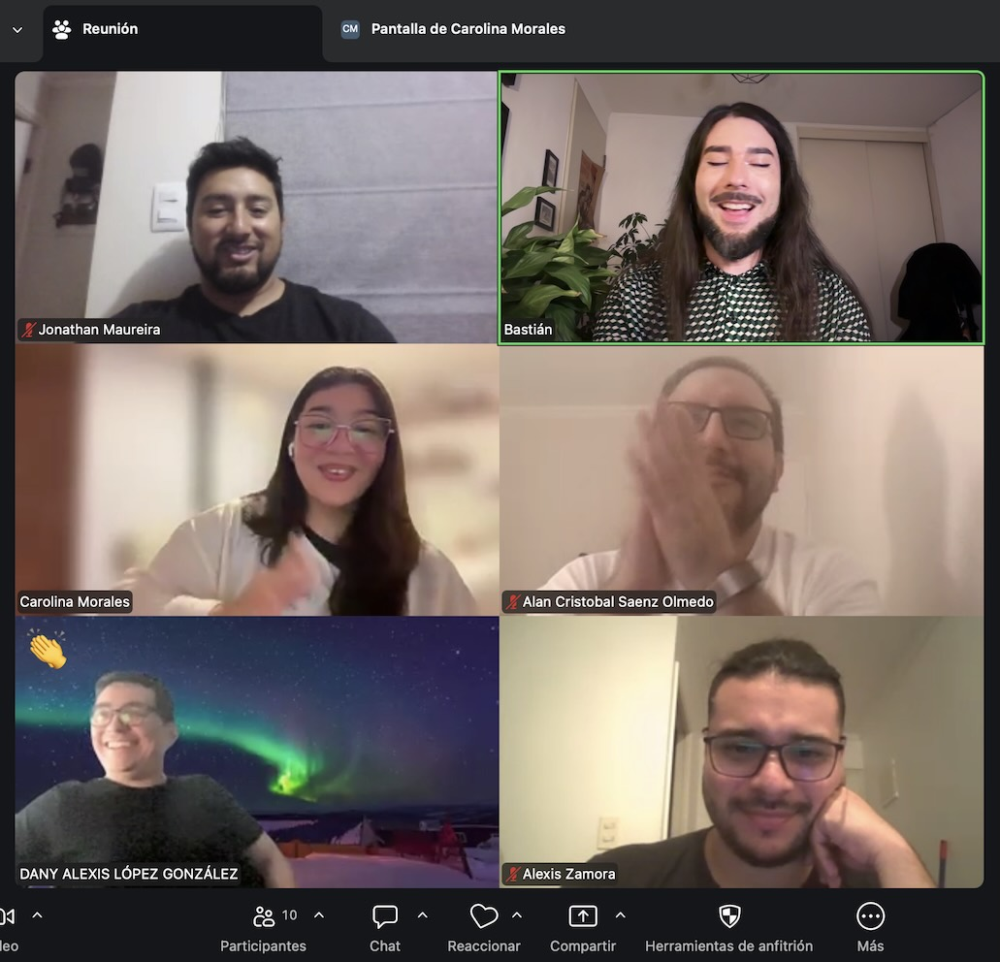
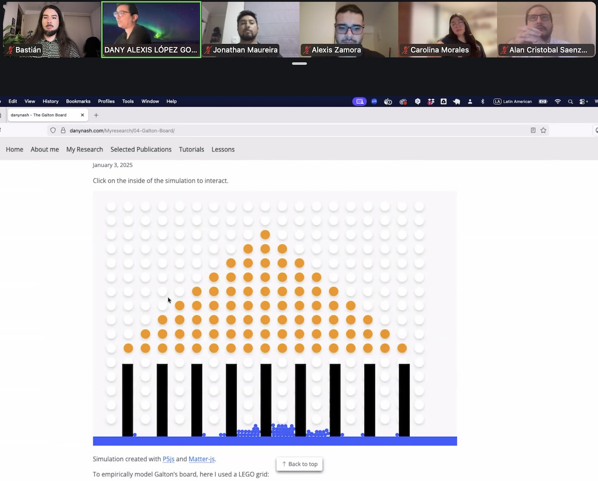
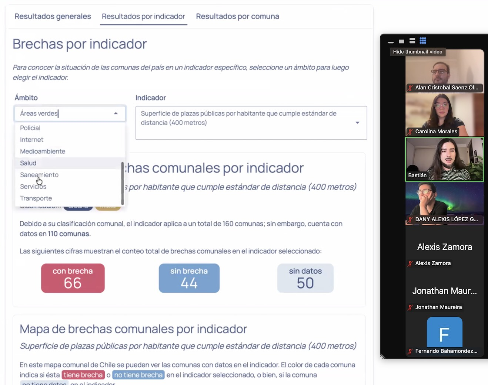

Ya fue nuestra primera junta online de usuarios/as de R! 👩🏻‍💻👨🏽‍💻

Vimos usos de R en disciplinas tan distintas como **biología, sociología** y **física**, y en temas tan diversos como comercio y salmonicultura 🐟

Más de 10 usuarias y usuarios de R participaron contando sus experiencias con la programación, mostrando sus proyectos en R, y jugando a la trivia 🤓

Nos vemos en la junta del próximo mes, y atención a nuestras redes sociales para más formas de crear comunidad ✨

::: {.galeria}
{.fotito .lightbox group="galeria"}
{.fotito .lightbox group="galeria"}
{.fotito .lightbox group="galeria"}
{.fotito .lightbox group="galeria"}
{.fotito .lightbox group="galeria"}
{.fotito .lightbox group="galeria"}
:::