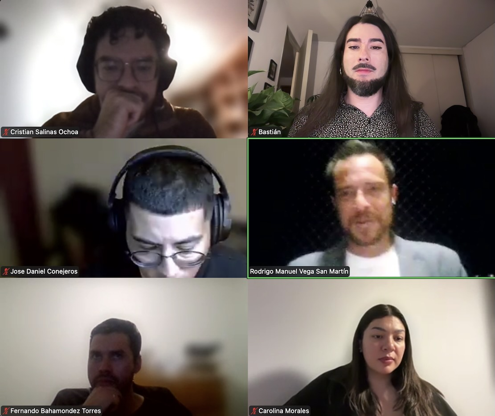
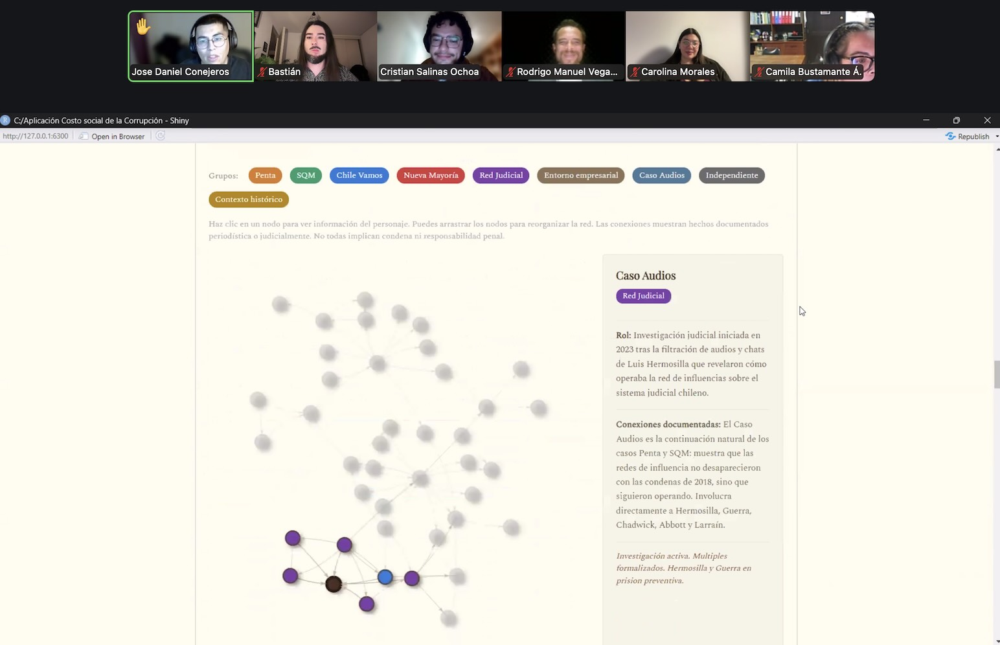
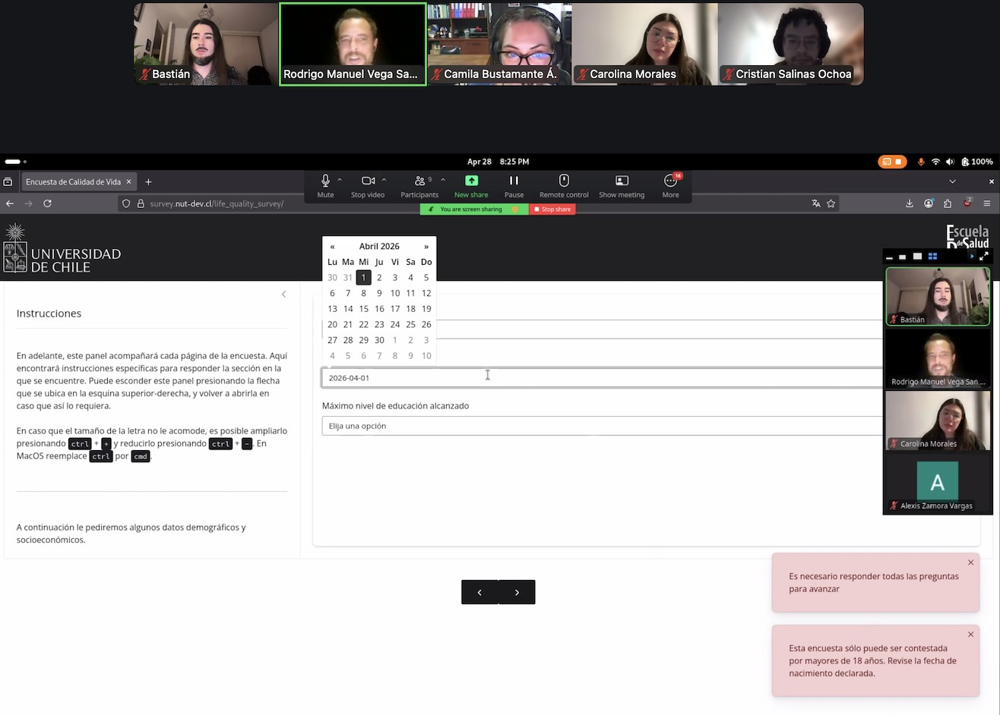
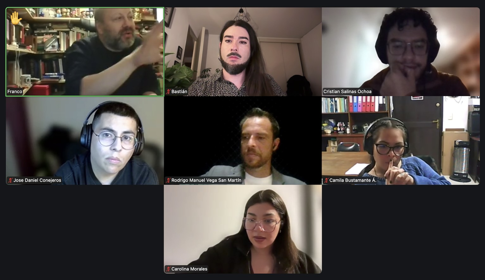
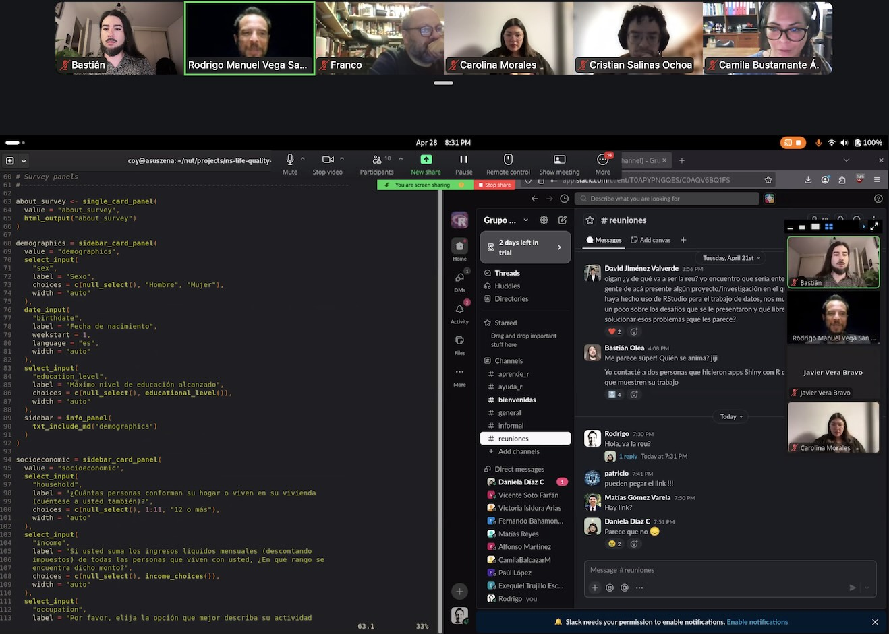
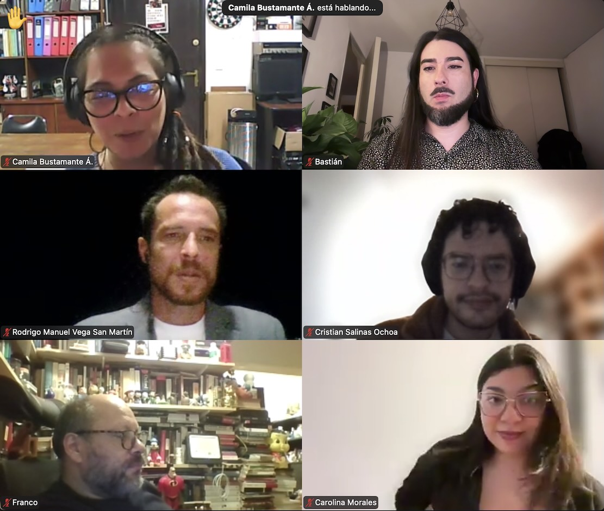
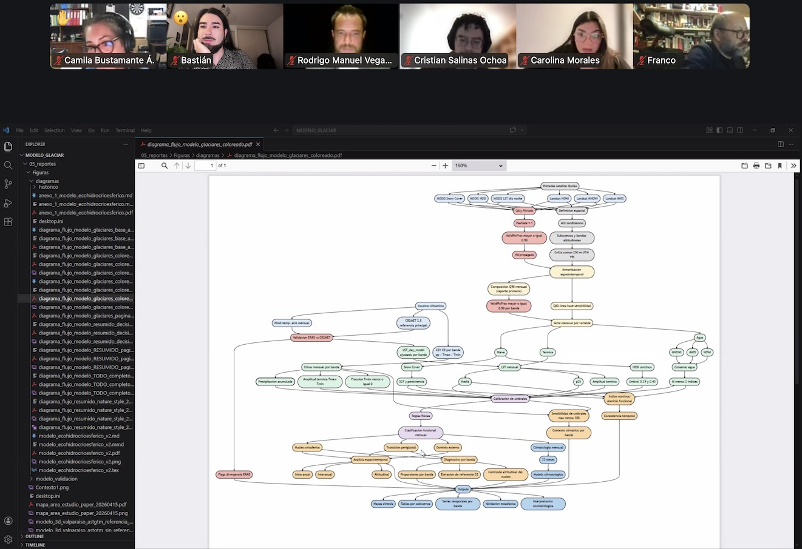
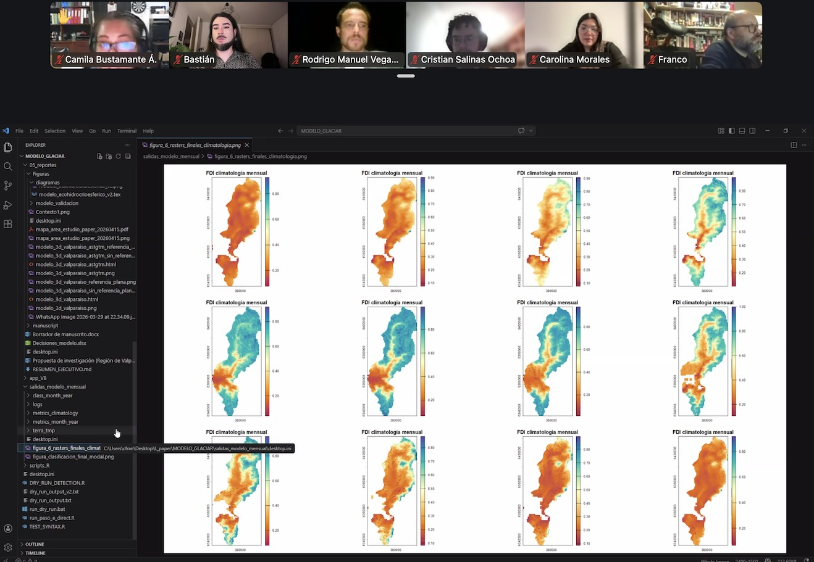
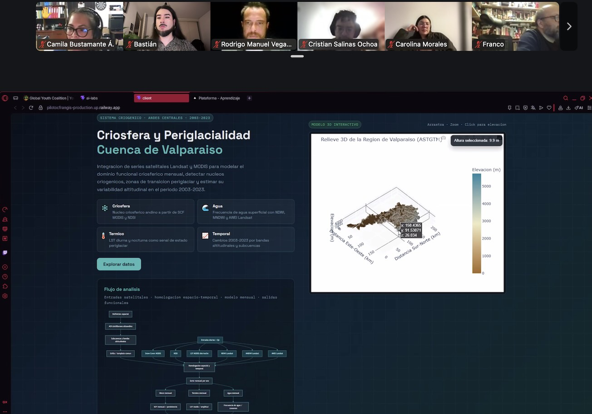
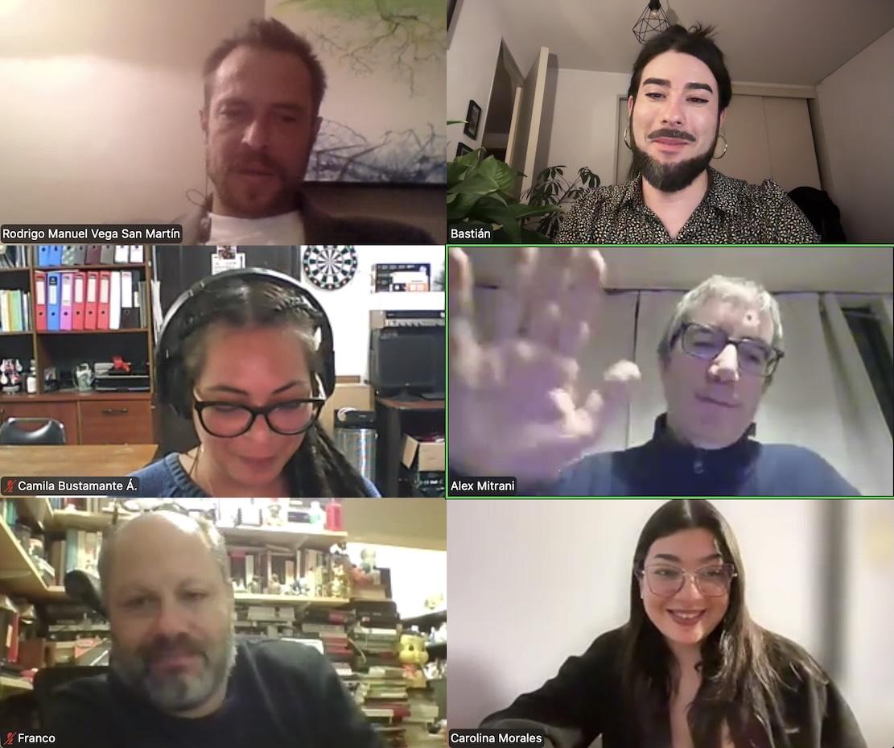

En esta **segunda** reunión online de usuarios/as de R nos encontramos con usos de R en ámbitos como **geología, biología, ingeniería,  ecología, ciencias políticas, salud, transporte**, y más! 

Algunos temas que conversamos:

- Transformación digital y los beneficios traer y proponer tecnologías como R en nuestras organizaciones/empresas
- La potencia de programadores/as de R, que venimos de distintas disciplina y tenemos perspectivas particulares, versus programadores tradicionales, así como las desventajas
- La importancia del _storytelling_ y el relato al presentar datos como un factor que diferencia los productos posibles
- El uso ético de la inteligencia artificial y el impacto que puede tener en labores ligadas a la investigación y el análisis de datos

Nos vemos en la junta del próximo mes, así que [atención a nuestras redes sociales](/about.html) para mantenernos en contacto ✨

::: {.galeria}
{.fotito .lightbox group="galeria"}
{.fotito .lightbox group="galeria"}
{.fotito .lightbox group="galeria"}
{.fotito .lightbox group="galeria"}
{.fotito .lightbox group="galeria"}
{.fotito .lightbox group="galeria"}
{.fotito .lightbox group="galeria"}
{.fotito .lightbox group="galeria"}
{.fotito .lightbox group="galeria"}
{.fotito .lightbox group="galeria"}
{.fotito .lightbox group="galeria"}
{.fotito .lightbox group="galeria"}
:::